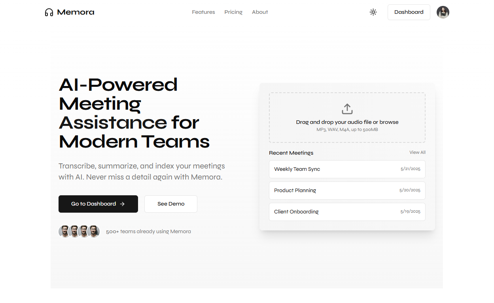

# Memora: AI Meeting Memory Assistant
 

Memora is an AI-powered meeting memory assistant designed to summarize, track, and manage your team’s meeting knowledge. It acts like a virtual project manager that never forgets past meetings and always keeps your team aligned.


## Key Features

- Upload meeting audio or transcript
- Automatic transcription + speaker diarization
- AI-powered meeting summaries
- Action item and decision extraction
- Long-term memory of projects & tasks
- Slack + email reminders of unfinished tasks
- Web dashboard for browsing meeting history and tasks

## System Architecture

```pgsql
                       +-------------------+
                       |      Frontend     |
                       |  Next.js + Clerk  |
                       +-------------------+
                                 |
                                 v
                       +-------------------+
                       |      FastAPI      |
                       |  API Gateway +    |
                       |  LLM Task Router  |
                       +-------------------+
                                 |
         ------------------------------------------------
         |                      |                      |
         v                      v                      v
+----------------+    +-------------------+   +------------------+
| Speech-to-Text |    |   LLM Processor   |   | Notification Svc |
| (Whisper /     |    | (Summary + Tasks) |   | (Slack + Email)  |
| AssemblyAI)    |    +-------------------+   +------------------+
+----------------+
         |
         v
+--------------------------------------------------+
|               PostgreSQL + Weaviate              |
| Project Memory: Meetings, Tasks, Summaries, Vectors |
+--------------------------------------------------+

Data flow:
Frontend → API → Process (STT + LLM) → Store (Postgres + Vector DB) → Notify User

```

## Tech Stack

- Backend: Python, FastAPI
- Speech-to-Text: OpenAI Whisper / AssemblyAI
- LLM: LLaMA 3, GPT-4o, or Claude
- Database: PostgreSQL + Weaviate (vector memory)
- Frontend: Next.js, TypeScript, shadcn/ui
- State Management: Zustand
- Authentication: Clerk
- Emails: Resend
- Hosting: Vercel + AWS

## Folder Structure
```bash
memora/
├── backend/
├── frontend/
├── models/
├── data/
├── docs/
├── scripts/
├── docker/
├── .env.example
├── README.md
└── LICENSE
```

---

## How to Run Locally

### 1. Clone the repo
```bash
git clone https://github.com/yourusername/memora.git
cd memora
```

2. Setup backend
```bash
cd backend
python -m venv venv
source venv/bin/activate
pip install -r requirements.txt
uvicorn app.main:app --reload
```
3. Setup frontend
```bash
cd frontend
pnpm install
pnpm dev
```
OR
```bash
cd frontend
npm install 
npm run dev
```

## **MVP Feature Backlog**

This is the suggested **feature task list for first release.**  

| Priority | Feature | Notes |
|---------|---------|-------|
| High | Audio Upload System | User uploads .mp3, .wav |
| High | Speech-to-Text Pipeline | Whisper or AssemblyAI |
| High | Speaker Diarization | Separate "who said what" |
| High | LLM Meeting Summary | GPT-4o / LLaMA 3 basic summary |
| High | Task & Decision Extraction | Identify owners + deadlines |
| Medium | Store Sessions to DB | PostgreSQL schema for projects |
| Medium | Slack / Email Reminders | Unfinished tasks reminders |
| Medium | Web Dashboard | Next.js UI for meetings + tasks |
| Medium | Authentication | Clerk integration |
| Low | Google Calendar Integration | Auto fetch participants + times |
| Low | Real-time Note Taking Agent | (Advanced demo only) |

## Roadmap 
 - Audio upload + STT pipeline
 - LLM-powered meeting summary
 - Task + decision extractio
 - Long-term memory DB
 - Slack/email reminders
 - Web dashboard
 - Google Calendar integration 
